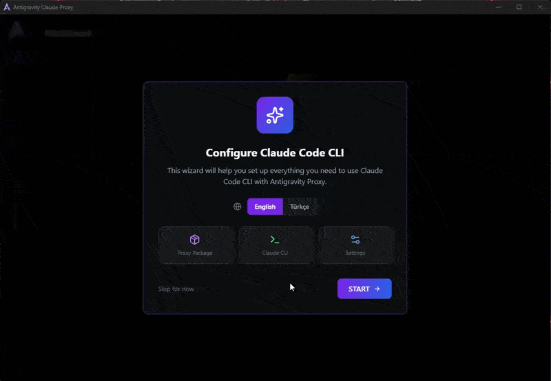
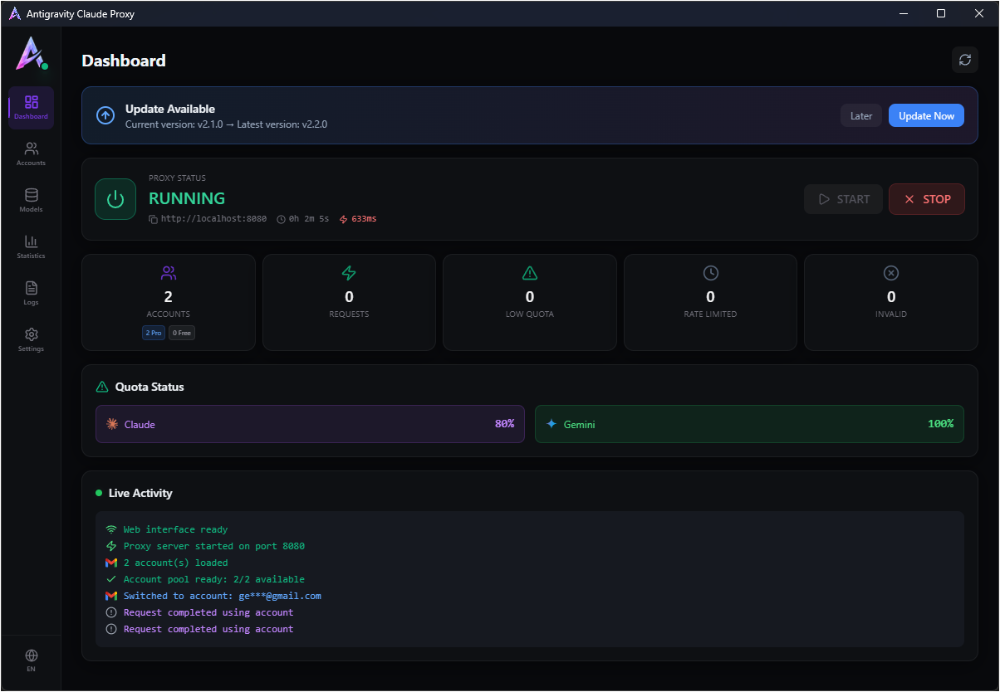
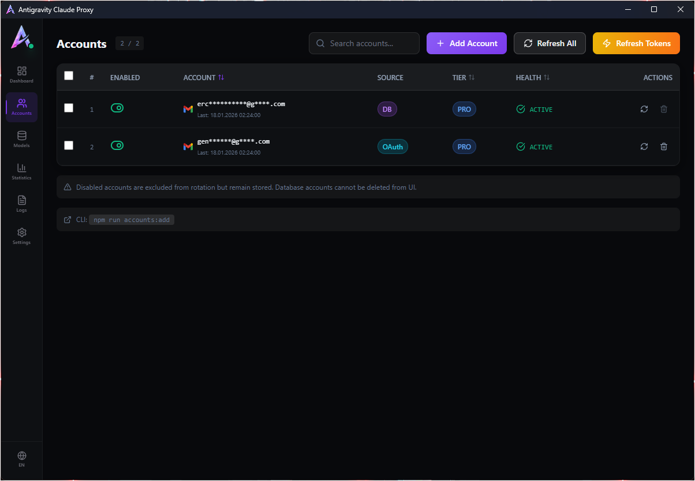
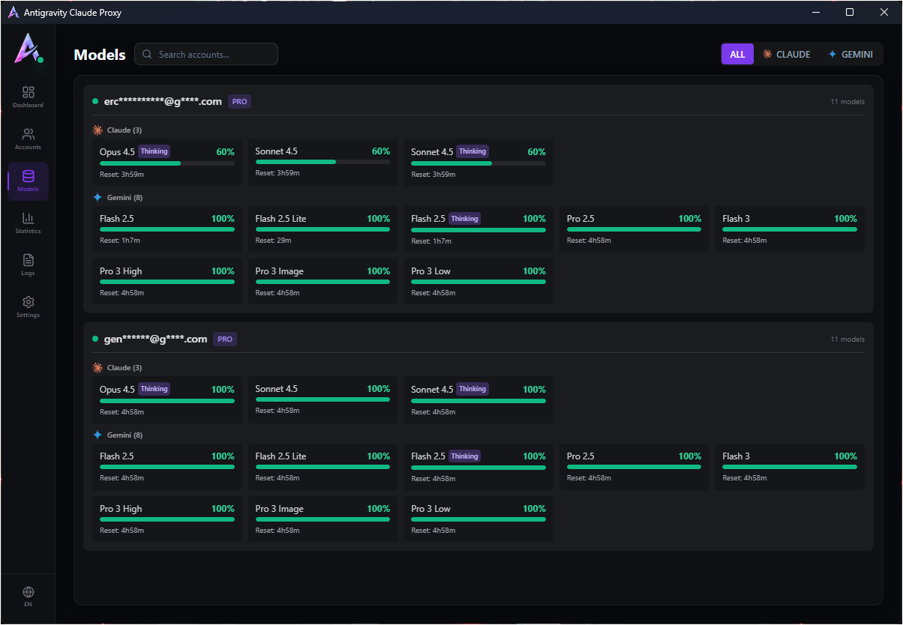
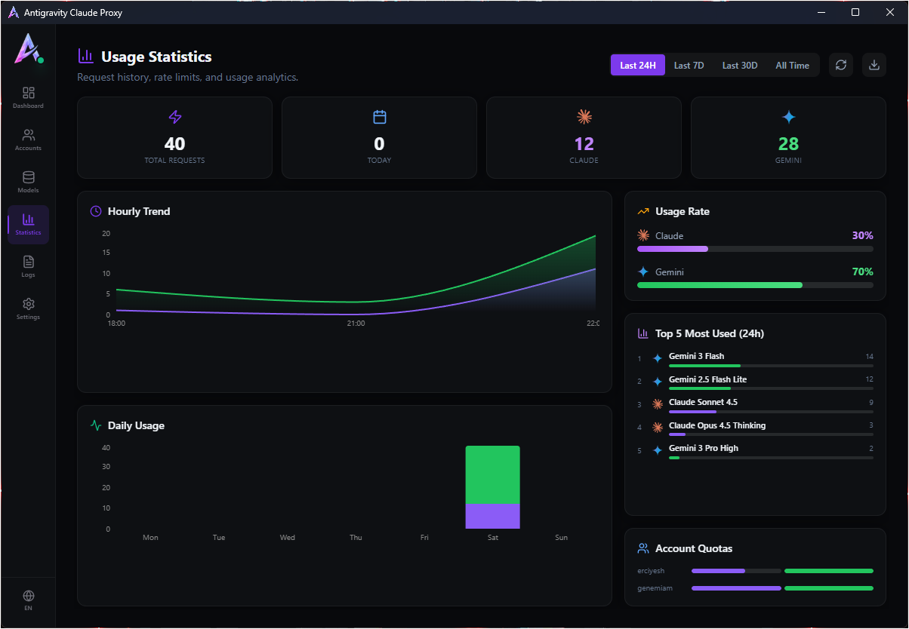
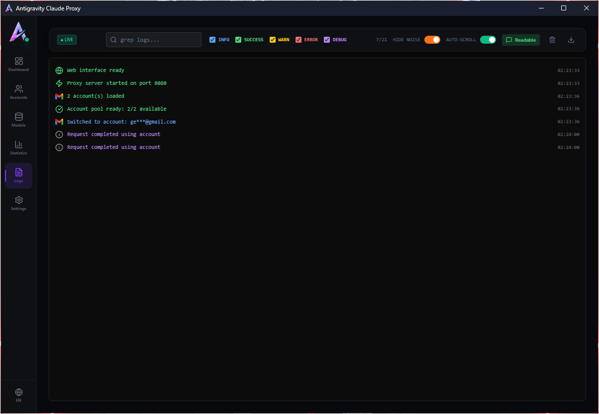

# Antigravity Claude Proxy GUI

[antigravity-claude-proxy](https://github.com/badrisnarayanan/antigravity-claude-proxy) npm paketi için masaüstü arayüzü. Bu uygulama sadece bir GUI'dir, arka planda proxy paketi çalışır.

A desktop GUI for the [antigravity-claude-proxy](https://github.com/badrisnarayanan/antigravity-claude-proxy) npm package. This app is just a graphical interface - the proxy package runs in the background.

---

## Özellikler / Features

- **Çoklu Hesap Yönetimi / Multi-Account Management**  
  Birden fazla hesabı ekleyin ve otomatik rotasyon ile kullanın.  
  Add multiple accounts and use them with automatic rotation.

- **Model Yönetimi / Model Management**  
  Modelleri sabitleyin, gizleyin veya yeniden eşleştirin.  
  Pin, hide, or remap models.

- **Kiro IDE Entegrasyonu / Kiro IDE Integration**  
  Kiro IDE için tek tıkla etkinleştirme.  
  One-click activation for Kiro IDE.

- **Claude CLI Desteği / Claude CLI Support**  
  Claude Code için otomatik yapılandırma.  
  Auto-configuration for Claude Code.

- **İstatistikler / Statistics**  
  Kullanım geçmişi ve grafikleri.  
  Usage history and charts.

- **Cross-Platform**  
  Windows, macOS, Linux desteği.  
  Windows, macOS, Linux support.

---

## Ekran Görüntüleri / Screenshots

### Kurulum / Setup


### Panel / Dashboard


### Hesaplar / Accounts


### Modeller / Models


### İstatistikler / Statistics


### Loglar / Logs


---

## Kurulum / Installation

### Hazır İndirmeler / Pre-built Downloads

[Releases](https://github.com/StRonKEA/Antigravity-Claude-Proxy-GUI/releases) sayfasından platformunuza uygun dosyayı indirin:

Download from the [Releases](https://github.com/StRonKEA/Antigravity-Claude-Proxy-GUI/releases) page:

| Platform | Dosya / File |
|----------|--------------|
| Windows | `.msi` veya `.exe` |
| macOS (Intel) | `.dmg` (x64) |
| macOS (Apple Silicon) | `.dmg` (arm64) |
| Linux | `.deb`, `.rpm`, `.AppImage` |

### Kaynak Koddan Derleme / Build from Source

```bash
# Bağımlılıkları yükle / Install dependencies
npm install

# Geliştirme modunda çalıştır / Run in development mode
npm run tauri dev

# Production build al / Build for production
npm run tauri build
```

---

## Gereksinimler / Requirements (Sadece kaynak koddan derleme için)

- Node.js 18+
- Rust (Tauri için / for Tauri)
- npm

---

## Lisans / License

MIT

---

## Teşekkürler / Credits

| Proje | Açıklama |
|-------|----------|
| [antigravity-claude-proxy](https://github.com/badrisnarayanan/antigravity-claude-proxy) | Proxy core by [@badrisnarayanan](https://github.com/badrisnarayanan) |
| [@ruwiss](https://github.com/ruwiss) | Kiro IDE entegrasyonu fikri / Kiro IDE integration idea |
